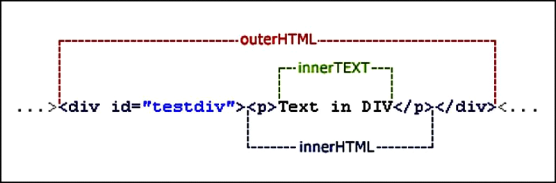
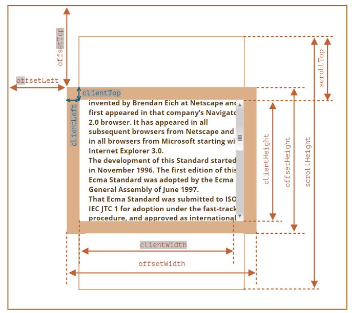
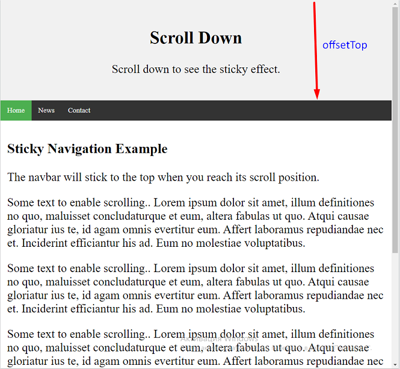
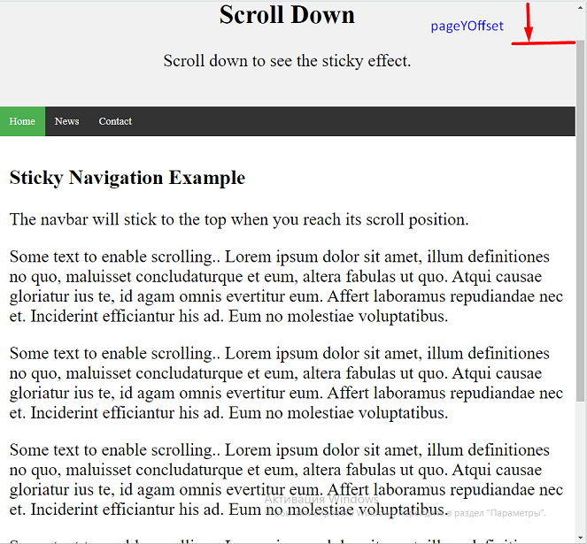

# JS DOM
## ✨✨Attributes✨✨
```js
<body>
  <div id="elem" about="Elephant"></div>
  <a id="a" href="#hello">link</a>
  <script>
    elem.getAttribute('About') // 'Elephant', reading

    elem.setAttribute('Test', 123); // writing

    elem.outerHTML;  // <div id="elem" about="Elephant" test="123"></div>
    
    elem.attributes // [id, about, test]
    //NamedNodeMap {0: id, 1: about, 2: test, id: id, about: about, test: test, length: 3}
    // id.name = 'id', id.value = 'elem'

    a.getAttribute('href'); // #hello
    a.href // full URL in the form http://.../...#hello
  </script>
</body>
```
### 💡 InnerHTML vs OuterHTML


### Получение элемента с  атрибутом
```js
<div data-widget-name="menu">Choose the genre</div>
```
> `let elem = document.querySelector('[data-widget-name]');`
### Attributes starting with “data-”
> They are available in the dataset property.
```js
<body data-about="Elephants">
<script>
  document.body.dataset.about; // Elephants
</script>
```
## ✨✨Node manipulation✨✨

```js
// 1. Create <div> element
let div = document.createElement('div');

// 2. Set its class to "alert"
div.className = "alert";

// 3. Fill it with the content
div.innerHTML = "<strong>Hi there!</strong> You've read an important message.";

// 4. Adding an element
document.body.append(div);

// 5. Removal node
setTimeout(() => div.remove(), 1000);
```
### cloneNode
>The call `elem.cloneNode(true)` creates a “deep” clone of the element – with all attributes and subelements. 
>If we call `elem.cloneNode(false)`, then the clone is made without child elements.
```js
<body>
    <div class="alert" id="div">
    <strong>Hi there!</strong> You've read an important message.
    </div>

    <script>
    // clone the message
    let div2 = div.cloneNode(true);
     // change the clone 
    div2.querySelector('strong').innerHTML = 'Bye there!';
    // show the clone after the existing div
    div.after(div2); 
    </script>
</body>
```
## ✨✨Node create, styled and classes✨✨
* createElement
* `let elem = document.createElement('div');`
*  className
* `elem.className = "notification";`   
* classList   
* `elem.classList.add(className);`
* style
* `elem.style.top = top + 'px';`
* innerHTML
* `elem.innerHTML = html;`
* append
* `document.body.append(elem);`
* remove
* `setTimeout(() => div.remove(), 1500);`
 ### 💡 `getComputedStyle()` возвращает объект, содержащий значения всех CSS-свойств элемента
> readonly
#### exemple:
 ```js
<span id="elem">Hello!</span>

<script>
  alert( getComputedStyle(elem).width ); // auto
</script>
 ```
## ✨✨Size and scrolling✨✨

> 
>`offsetWidth`/`Height` -  full size including borders (`clientLeft`  – left border width, `clientTop`  – top border width) and padding

### scrollWidth/Height

>`element.scrollHeight` - высота контента в элементе, включая содержимое, невидимое из-за прокрутки
### scrollLeft/scrollTop
> Свойство `scrollTop` считывает или устанавливает количество пикселей, прокрученных от верха элемента. `scrollTop` измеряет дистанцию от верха элемента до верхней точки видимого контента. Когда контент элемента не создаёт вертикальную прокрутку, его `scrollTop` равно `0`.
```js
//Получаем количество прокрученных пикселей
let intElemScrollTop = someElement.scrollTop;
// Устанавливаем количество прокрученных пикселей
element.scrollTop = intValue;
```
### Window.pageYOffset
>`pageYOffset` - свойство окна Window , доступное ТОЛЬКО ДЛЯ ЧТЕНИЯ. Это то же свойство, что и `scrollY` (более новое название) и, как таковое, оно тоже возвращает количество пикселей, на которое прокручен документ по вертикали (вниз или вверх).
* Пример. Навбар получит "sticky" класс когда дойдёт до края

* 

* 
```js
const navbar = document.getElementById("navbar");
const sticky = navbar.offsetTop;

function myFunction() {
console.log(window.pageYOffset)
  if (window.pageYOffset >= sticky) {
  navbar.classList.add("sticky")
  } else {
  navbar.classList.remove("sticky");
  }
}
```
### Методы МЕНЯЮЩИЕ скролл:  `scrollTo`, `scrollBy`, `scrollIntoView`

### 💡 `document.body.style.overflow = "hidden"` запретит полосу прокрутки

## ✨✨Coordinates✨✨

### `elem.getBoundingClientRect()` ( don't forget "px"!)
> `getBoundingClientRect().left`
> 
> `getBoundingClientRect().top`
> 
> `getBoundingClientRect().width`
> 
> `getBoundingClientRect().height`
* func created html element and location it:
```js
let elem = document.getElementById("coords-show-mark");

function createMessageUnder(elem, html) {
  // create message element
  let message = document.createElement('div');
  // better to use a css class for the style here
  message.style.cssText = "position:fixed; color: red";

  // assign coordinates, don't forget "px"!
  let coords = elem.getBoundingClientRect();

  message.style.left = coords.left + "px";
  message.style.top = coords.bottom + "px";
  
  message.innerHTML = html;

  return message;
}

// Usage:
// add it for 5 seconds in the document
let message = createMessageUnder(elem, 'Hello, world!');
document.body.append(message);
setTimeout(() => message.remove(), 5000);

```
### 💡 elem.style.cssText
> interface returns or sets the text of the element's inline style (!!!) declaration only.
```html
<span id="s1" style="color: red;">
  Some text
</span>

<script>
  var elem = document.getElementById("s1");
  elem.style.cssText = "position:fixed; color: blue";
  alert(elem.style.cssText); // "position:fixed; color: blue""
</script>
```